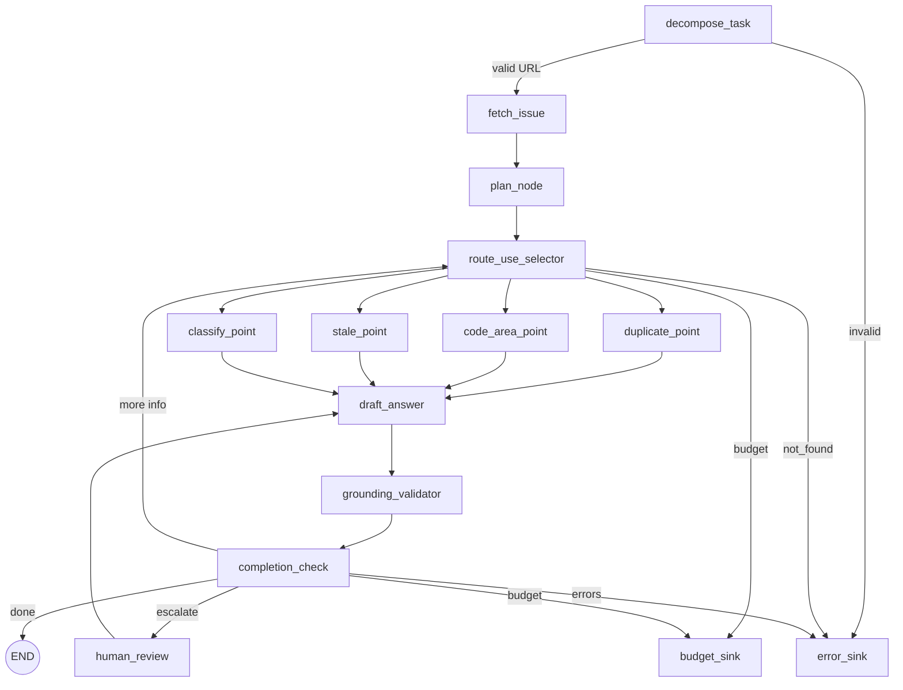

# Документація по коду GitHub Triage Agent

Детальний опис архітектури, потоків даних, метрик і системи оцінки (eval).  
Репозиторій: `github-triage-agent`.

**Пов’язані файли:** [DEMO_AND_METRICS.md](./DEMO_AND_METRICS.md) (коротке демо), [EXTENDED_METRICS_UA.md](./EXTENDED_METRICS_UA.md) (розширені метрики), [../prompts/TESTING_EXAMPLES.md](../prompts/TESTING_EXAMPLES.md) (приклади CLI).

---

## Зміст

1. [Призначення системи](#1-призначення-системи)
2. [Структура репозиторію](#2-структура-репозиторію)
3. [Точки входу](#3-точки-входу)
4. [Граф агента (LangGraph)](#4-граф-агента-langgraph)
5. [Стан агента (`IssueTriageState`)](#5-стан-агента-issuetriagestate)
6. [Вузли графа](#6-вузли-графа)
7. [Grounding і fact-check](#7-grounding-і-fact-check)
8. [Один прогон: trajectory і метрики](#8-один-прогон-trajectory-і-метрики)
9. [Evaluation (eval)](#9-evaluation-eval)
10. [Скоринг: `score_result()`](#10-скоринг-scoreresult)
11. [Критерії в `tasks.json`](#11-критерії-в-tasksjson)
12. [`summary.json`: усі поля](#12-summaryjson-усі-поля)
13. [`triage_metrics`: усі підполя](#13-triage_metrics-усі-підполя)
14. [Скрипти та CLI](#14-скрипти-та-cli)
15. [Конфігурація (.env)](#15-конфігурація-env)
16. [Індекс файлів](#16-індекс-файлів)

---

## 1. Призначення системи

**GitHub Triage Agent** — LangGraph-агент, який:

1. Отримує URL GitHub issue (або задачу з eval-датасету).
2. Через **MCP-tools** завантажує issue, шукає дублікати, іноді fetch URL.
3. Формує **triage-звіт** (markdown).
4. Перевіряє звіт на **grounding** (відповідність даним з tools).
5. Зберігає **trajectory** (метрики прогону) у JSON.

**Окремо:** режим **`--eval`** проганяє 30 задач з `evaluation/tasks.json`, ставить **бали (score)** за автоматичною рубрикою і пише **`trajectories/summary.json`**.

```
Один issue (--url)     → trajectories/<uuid>.json     (метрики прогону, без score_pct)
Eval (--eval)          → trajectories/summary.json    (+ score, pass_rate, triage_metrics)
                       → trajectories/T001.json … T030.json
```

---

## 2. Структура репозиторію

| Шлях | Роль |
|------|------|
| `main.py` | CLI: один issue, eval, друк метрик |
| `api.py` | HTTP API (опційно) |
| `agent/` | Граф, стан, LLM, MCP, вузли |
| `agent/graph.py` | Збірка LangGraph |
| `agent/state.py` | `IssueTriageState`, `initial_state()` |
| `agent/nodes/` | Вузли: decompose, fetch, plan, workers, completion |
| `agent/nodes/completion.py` | Звіт, grounding, HIL |
| `agent/fact_extractor.py` | Regex fact-check |
| `agent/trajectory_export.py` | `message_trace`, підрахунок токенів |
| `agent/launch_modes.py` | Режими CLI: auto, hint-only, … |
| `evaluation/runner.py` | Eval, скоринг, агрегація метрик |
| `evaluation/tasks.json` | 30 задач + критерії + rubric (текст) |
| `evaluation/ablations.py` | A/B: моделі, промпти, граф |
| `mcp_server/server.py` | Власний MCP (GitHub tools) |
| `trajectories/` | Результати прогонів |
| `scripts/show_eval_summary.py` | Людський вивід summary |
| `scripts/show_trajectory_metrics.py` | Метрики одного trajectory-файлу |
| `docs/` | Документація |

---

## 3. Точки входу

### 3.1. `main.py`

**Файл:** `main.py`  
**Функції:** `run_triage()`, `main()` (async CLI).

#### `run_triage(issue_url, task_hint, user_prompt, …)`

1. Створює `run_id`, підключає **MultiServerMCPClient** (`agent/mcp_config.py`).
2. Завантажує tools → `build_graph()` → `initial_state()`.
3. `graph.ainvoke(state, config)` — повний прохід графа.
4. Опційно **HIL** (`human_review`): interrupt, `input()`, повторний `ainvoke`.
5. Збирає **trajectory** і повертає:

```python
{
    "report": str,      # triage_report
    "state": dict,      # фінальний стан графа
    "trajectory": dict, # експорт для JSON
}
```

**Код trajectory:** `main.py` ~225–247.

#### CLI-прапорці (головні)

| Прапорець | Дія |
|-----------|-----|
| `--url` | Один issue |
| `--hint` | `duplicate` \| `code_area` \| `stale` \| `classify` |
| `--prompt` / `--prompt-file` | Додаткові інструкції |
| `--launch-mode` | `auto`, `hint-only`, `hint-prompt`, `prompt-auto` |
| `--no-hil` | Без human-in-the-loop |
| `--eval` | Запуск `evaluation.runner.run_evaluation` |
| `--output` | Папка trajectories (default `trajectories`) |
| `--print-metrics` | JSON метрик у консоль |
| `--explain-metrics` | Пояснення полів trajectory (один URL) |
| `--metrics-out` | Зберегти метрики у файл |

### 3.2. `api.py`

REST-обгортка над тим самим графом; повертає `grounding_passed`, trajectory-поля в відповіді API. Деталі — у docstring і моделях Pydantic у файлі.

---

## 4. Граф агента (LangGraph)

**Файл:** `agent/graph.py` → `build_graph()`.

### 4.1. Діаграма потоку



### 4.2. Узли

| Node | Файл | Призначення |
|------|------|-------------|
| `decompose_task` | `nodes/decompose.py` | Парсинг URL → owner/repo/number |
| `fetch_issue` | `nodes/fetch.py` | MCP `fetch_github_issue` |
| `plan_node` | `nodes/planner.py` | `task_type`, план кроків |
| `duplicate_point` | `nodes/workers.py` | Пошук дублікатів |
| `code_area_point` | `nodes/workers.py` | Модуль/область коду |
| `stale_point` | `nodes/workers.py` | Застарілі issue |
| `classify_point` | `nodes/workers.py` | Класифікація типу |
| `draft_answer` | `nodes/completion.py` | Текст звіту |
| `grounding_validator` | `nodes/completion.py` | Перевірка звіту |
| `completion_check` | `nodes/completion.py` | Loop / escalate / end |
| `human_review` | `nodes/completion.py` | HIL (interrupt) |
| `error_sink` | `graph.py` | Помилка → звіт |
| `budget_sink` | `graph.py` | Ліміт tool calls |

### 4.3. Маршрутизація

**Файл:** `agent/nodes/router.py`

| Функція | Умова | Куди |
|---------|--------|------|
| `route_after_decompose` | `task_type == invalid` або багато помилок | `error_sink` |
| `route_by_task_type` | `tool_calls_count >= MAX_TOOL_CALLS` | `budget_sink` |
| `route_by_task_type` | `task_type` | відповідний worker |
| `route_after_completion` | `needs_more_info` | loop → workers |
| `route_after_completion` | `should_escalate` | `human_review` |
| `route_after_completion` | інакше | `END` |

**Env:** `MAX_TOOL_CALLS` (default 25), `MAX_LOOPS` (default 3).

### 4.4. Checkpointer і HIL

```python
compiled = g.compile(
    checkpointer=cp,
    interrupt_before=["human_review"],
)
```

Без `--no-hil` CLI може зупинитися на `human_review` і чекати `approve` / feedback.

---

## 5. Стан агента (`IssueTriageState`)

**Файл:** `agent/state.py`

### 5.1. Durable (зберігається в checkpoint)

| Поле | Тип | Опис |
|------|-----|------|
| `issue_url` | str | Вхідний URL |
| `task_hint` | str? | Підказка гілки |
| `user_prompt` | str? | Користувацький промпт |
| `repo_owner`, `repo_name`, `issue_number` | | З decompose |
| `task_type` | str? | `duplicate` \| `code_area` \| `stale` \| `classify` |
| `plan` | list | Кроки плану |
| `fetched_issue` | dict? | JSON issue з GitHub |
| `similar_issues` | list | Результати пошуку |
| `tool_results` | list[dict] | Усі виклики tools `{tool, result, …}` |
| `triage_findings` | dict | Structured findings, зокрема `classification` |
| `triage_report` | str? | Фінальний markdown-звіт |
| `grounding_passed` | bool | Результат валідатора |
| `fact_check` | dict? | Regex fact-check |
| `tool_calls_count` | int | Лічильник викликів |
| `loop_count` | int | Кількість циклів |
| `run_id` | str | UUID прогону |

### 5.2. Scratchpad

| Поле | Опис |
|------|------|
| `messages` | Історія LLM (LangGraph `add_messages`) |
| `error_count`, `last_error` | Помилки виконання |
| `human_feedback` | Відповідь користувача при HIL |

**Початковий стан:** `initial_state()` у тому ж файлі (~60–94).

---

## 6. Вузли графа

### 6.1. Decompose і fetch

- **decompose:** витягує `owner`, `repo`, `issue_number`; невалідний URL → `task_type=invalid`.
- **fetch:** викликає MCP, додає запис у `tool_results`, заповнює `fetched_issue`.

### 6.2. Planner

**Файл:** `agent/nodes/planner.py`  
Визначає `task_type` (якщо не задано hint) і `plan`. Враховує `task_hint`, `user_prompt`, вміст issue.

### 6.3. Workers

**Файл:** `agent/nodes/workers.py`  
Чотири спеціалізовані гілки викликають різні tools (пошук, структура репо тощо) і оновлюють `triage_findings`.

### 6.4. Completion

**Файл:** `agent/nodes/completion.py`

- `draft_answer` — генерує `triage_report`.
- `grounding_validator` — див. [розділ 7](#7-grounding-і-fact-check).
- `completion_check` — виставляє `needs_more_info`, `should_escalate` для router.
- `human_review` — HIL.

---

## 7. Grounding і fact-check

### 7.1. Навіщо

Переконатися, що **конкретні факти в звіті** (номери issue, імена, шляхи) **є в даних**, які повернули tools, а не вигадані LLM.

### 7.2. Три шари (`grounding_validator`)

**Файл:** `agent/nodes/completion.py` ~275–370

| Шар | Механізм | Код |
|-----|----------|-----|
| 1 | LLM-as-judge | `GROUNDING_PROMPT`, `_llm_grounding_call()` |
| 2 | Regex fact-check | `check_facts_against_blob()` → `agent/fact_extractor.py` |
| 2 enforcement | Якщо regex FAIL, а LLM PASS → **примусовий FAIL** | ~324–334 |
| 3 (опційно) | Другий LLM | `TRIAGE_DOUBLE_GROUNDING=1`, `SECOND_PASS_PROMPT` |

**Ground truth blob:** `_build_ground_truth_blob(state)` — tool_results + findings + body issue.

### 7.3. Fact-check (regex)

**Файл:** `agent/fact_extractor.py`

Витягує з звіту:

- `#123` (номери issue)
- `@username`
- шляхи файлів (`*.py`, …)
- URL

Порівнює з blob; невідомі → `invented[]`, `passed=false` якщо поріг не виконано.

**Результат у state:** `fact_check` → потрапляє в trajectory.

### 7.4. Зв’язок зі score

`score_result()` читає `grounding_passed` через `_grounding_passed_effective()`:

**Файл:** `evaluation/runner.py` ~86–96, ~479–488.

Якщо є звіт, але grounding не пройшов → **−1 бал** (навіть якщо `grounding_required` false — додається WARN demerit).

---

## 8. Один прогон: trajectory і метрики

### 8.1. Збір trajectory

**Файл:** `main.py` → `run_triage()` ~227–247

Після графа формується dict і зберігається як `trajectories/<run_id>.json` (+ `report`).

| Поле trajectory | Джерело | Сенс |
|-----------------|---------|------|
| `run_id` | UUID | Ідентифікатор |
| `issue_url` | вхід | |
| `launch_mode` | CLI | auto / hint-only / … |
| `task_type` | state | Тип тріажу |
| `tool_calls` | `tool_calls_count` | Кількість викликів |
| `grounding_passed` | state | |
| `fact_check` | state | |
| `duration_s` | wall clock | |
| `tool_results` | state | Доказова база |
| `message_trace` | `message_trace_from_state()` | LLM повідомлення |
| `token_usage_est` | `aggregate_token_usage()` | Оцінка токенів |
| `report` | triage_report | Повний текст |

**Токени:** `agent/trajectory_export.py` → `aggregate_token_usage()` ~102–119 — сума `usage_metadata` / `response_metadata` по trace.

### 8.2. Пояснення полів у CLI

**Файл:** `main.py` → `_TRAJECTORY_METRIC_HELP_UK` ~101–119, `print_trajectory_metrics_explained()` ~152–161.

### 8.3. Чого немає на одному issue

Немає: `score`, `score_pct`, `pass_rate`, `triage_metrics`, `tool_usage` (агрегат) — тільки після **eval**.

---

## 9. Evaluation (eval)

### 9.1. Запуск

```bash
python main.py --eval --output trajectories
```

**Файл:** `evaluation/runner.py` → `run_evaluation()` ~556+.

1. Читає `evaluation/tasks.json` (`TASKS_FILE` ~27).
2. Для кожної задачі: `run_triage(url, hint)` з `main.py`.
3. `score_result(task, result)`.
4. Запис `trajectories/T00x.json` (+ `full_report`).
5. Агрегація → `summary.json`.
6. Друк `EVALUATION COMPLETE` + `print_eval_metrics_separated(summary)` ~874.

### 9.2. Структура задачі в `tasks.json`

```json
{
  "task_id": "T010",
  "category": "happy_path",
  "type": "classify",
  "description": "...",
  "input": { "issue_url": "...", "hint": null },
  "success_criteria": { ... },
  "expected_tools": ["fetch_github_issue"],
  "forbidden_behaviors": [],
  "scoring": { "max_points": 3, "rubric": { "0": "...", "3": "..." } }
}
```

- **`category`:** `happy_path`, `ambiguous`, `adversarial`, `should_refuse` — для `by_category` у summary.
- **`type`:** сценарій (classify, duplicate, …) — для `by_task_type` у `triage_metrics`.
- **`scoring.rubric`:** **людський опис** рівнів 0–3; **не** автоматично оцінюється посимвольно — автоматOM йде `score_result()` по `success_criteria`.

### 9.3. Вихідні файли

| Файл | Зміст |
|------|--------|
| `trajectories/summary.json` | Зведення + `results[]` |
| `trajectories/T001.json` … `T030.json` | Score, reasons, trajectory, `full_report` |
| `trajectories/<uuid>.json` | Окремі прогони `--url` (не eval-id) |

---

## 10. Скоринг: `score_result()`

**Файл:** `evaluation/runner.py` ~433–553.

### 10.1. Алгоритм

```
score := max_points (зазвичай 3)
для кожного активного критерію в success_criteria:
    якщо порушення → score -= штраф (див. таблицю)
final_score := clamp(score, 0, max_points)
passed := final_score >= max_points * 0.66
```

При **max_points = 3** поріг **passed = true** якщо **score ≥ 2**.

### 10.2. Вхідні дані для рішення

| Джерело | Що використовується |
|---------|-------------------|
| `result["report"]` | lowercased текст для підрядків, ключових слів |
| `result["trajectory"]` | `tool_results`, `grounding_passed` |
| `result["state"]` | `triage_findings.classification.type` для `type_correct` |
| `task["success_criteria"]` | Які перевірки вмикати |
| `task["scoring"]["max_points"]` | Стартовий бал |

### 10.3. Таблиця штрафів (реалізовано в коді)

| Ключ `success_criteria` | Перевірка | Штраф | Рядки ~ |
|-------------------------|-----------|-------|---------|
| (crash / no report) | `forbidden_behaviors: crashing` або порожній report | → 0 | 449–456, 459–461 |
| `must_contain` | фрази ∈ report | −1 | 463–470 |
| `must_report_not_found` | "not found" / "404" / … | −2 якщо немає | 472–477 |
| grounding fail | `grounding_ok` не True і є report | −1 | 479–488 |
| `must_search` | `search_similar_issues` ∈ tool_results | −2 | 490–496 |
| `must_identify_module` | keywords module/file/… | −1 | 498–504 |
| `must_recommend_action` | recommend/suggest/close/… | −1 | 506–512 |
| `type_correct` | structured type або підрядок у report | −2 | 514–536 |
| `must_not_hallucinate_issue_content` | not found + report > 500 символів | −1 | 538–542 |

**PASS-рядки** додаються в `reasons[]`, штрафи — в `demerits[]`.

### 10.4. `type_correct` детально

1. Читає `state.triage_findings.classification.type`.
2. `normalize_issue_type()` — `agent/issue_types.py`.
3. `ok_struct` — `_type_correct_structural_match()` (дозволені типи + особливі bug+performance/security у тексті) ~127–140.
4. `ok_report` — чи є рядок типу в тексті звіту.
5. Якщо обидва false → demerit + −2.

**Приклад FAIL (T010):** очікували `bug`/`performance`, агент дав `question` → 3 − 2 = **1/3**, **FAIL**.

### 10.5. Crash у eval

**Файл:** `run_evaluation()` ~648–660 — exception → `score: 0`, `passed: false`, `error: str(e)`.

---

## 11. Критерії в `tasks.json`

### 11.1. Де дивитися критерії

| Що | Файл |
|----|------|
| Еталон по задачах | `evaluation/tasks.json` |
| Логіка перевірок | `evaluation/runner.py` → `score_result()` |
| Grounding | `agent/nodes/completion.py` |

### 11.2. Реалізовані в `score_result()` (автоматично)

Ці ключі в `success_criteria` **реально впливають** на бал:

- `must_not_crash`
- `must_contain`
- `must_report_not_found`
- `grounding_required` (разом із загальним штрафом за fail grounding)
- `must_search`
- `must_identify_module`
- `must_recommend_action`
- `type_correct`
- `must_not_hallucinate_issue_content`

### 11.3. Є в `tasks.json`, але НЕ в `score_result()` 

У датасеті зустрічаються ключі, для яких **немає** `criteria.get(...)` у `runner.py`. Вони задокументовані в rubric для людей, але **авто-score їх не перевіряє** (потрібно дописувати код або покладатися на часткове покриття через інші критерії):

`min_search_queries`, `must_reference_existing_issues`, `must_reference_issue_content`, `must_check_dates`, `must_acknowledge_uncertainty`, `must_not_hallucinate`, `must_read_body`, `reasoning_required`, `must_note_ambiguity`, `must_check_recent_activity`, `must_not_blindly_mark_stale`, `must_compare_root_causes`, `must_validate_url`, `must_check_issue_state`, `must_note_if_closed`, `must_detect_pr`, `must_note_scope_limitation`, `must_not_claim_to_close_issue`, `must_triage_only`, `must_flag_security`, `must_reject_non_github`, `must_identify_primary_area`, `must_handle_multiple_mentions`, `must_handle_fragment`, `must_triage_parent_issue`, …

**Важливо:** `forbidden_behaviors` майже не автоматизовані; лише `crashing` без report → 0. Рядок `"inventing issue numbers not found by search"` у коді — `pass` (пропуск) ~450–452.

### 11.4. `expected_tools`

Інформативне поле в JSON; **не** використовується в `score_result()` напряму. Фактичний пошук перевіряється через `must_search` + наявність tool у `tool_results`.

---

## 12. `summary.json`: усі поля

**Формування:** `evaluation/runner.py` ~718–745, після циклу по задачах ~664–716.

### 12.1. Верхній рівень

| Поле | Як рахується | Код |
|------|--------------|-----|
| `run_timestamp` | ISO час старту eval | ~590, 719 |
| `model` | `PRIMARY_MODEL` / override | ~720 |
| `total_tasks` | len(tasks) | ~721 |
| `pass_count` | count(`passed`) | ~667, 722 |
| `pass_rate` | pass_count / total_tasks | ~723 |
| `total_points` | sum(score) | ~665, 724 |
| `max_points` | sum(max_points) | ~666, 725 |
| `score_pct` | total_points/max_points×100 | ~726 |
| `avg_latency_s` | mean(elapsed_s) | ~691, 727 |
| `avg_tool_calls` | mean(trajectory.tool_calls) | ~692–694, 728 |
| `tool_usage` | count по іменах tool з усіх tool_results | ~680–689, 729 |
| `by_category` | pass/points по category | ~670–678, 730 |
| `results` | масив entry по задачах | ~731 |
| `error_tasks` | count(error) | ~700, 732 |

### 12.2. `grounding`

| Поле | Сенс | Код |
|------|------|-----|
| `passed_true` | задач з grounding_passed=true | ~706–707 |
| `passed_false` | false | ~708–709 |
| `unknown` | None / відсутнє | ~710–711 |
| `pass_rate_decided` | true / (true+false) | ~716–737 |

### 12.3. `token_usage_est_total`

Сума `trajectory.token_usage_est` по всіх задачах: `input_tokens`, `output_tokens`, `total_tokens` — ~712–714, 739–742.

### 12.4. `triage_metrics`

Див. [розділ 13](#13-triage_metrics-усі-підполя).

---

## 13. `triage_metrics`: усі підполя

Функції: `aggregate_triage_metrics()` ~143–217 + `build_auxiliary_metrics()` ~309–430, merge ~697–698.

### 13.1. `aggregate_triage_metrics`

| Поле | Сенс | Код |
|------|------|-----|
| `non_crash_tasks` | задач без error | ~197 |
| `crashed_tasks` | з error | ~163–165, 216 |
| `perfect_tasks` | score == max_points | ~171–172 |
| `perfect_rate` | perfect / non_crash | ~201 |
| `score_histogram` | {"0":n,"1":m,…} | ~169–170, 202 |
| `by_task_type` | pass/points по type з tasks.json | ~176–183, 203 |
| `grounding_when_required` | tasks/grounded/pass_rate | ~186–207, 204–208 |
| `passed_but_grounding_failed` | passed і grounding не true | ~191–192, 209 |
| `rubric_signals` | avg/total reasons і demerits | ~194–195, 210–215 |

### 13.2. `build_auxiliary_metrics`

| Поле | Сенс | Код |
|------|------|-----|
| `latency_s` | mean, p50, p90, p95, min, max, stdev | ~373–384, `_percentile` ~287 |
| `fact_check_summary` | агрегат regex fact-check | `_aggregate_fact_check` ~220–284 |
| `conditional_pass.must_search` | pass rate серед задач з must_search | ~340–343, 405–408 |
| `conditional_pass.type_correct_rubric` | pass серед type_correct | ~345–355, 410–414 |
| `type_confusion_matrix` | gold vs predicted, count | ~349–351, 389–392 |
| `grounding_vs_score` | середній score при g=true/false | ~357–371, 394–428 |

### 13.3. `fact_check_summary` (підполя)

| Поле | Сенс |
|------|------|
| `tasks_with_facts` | задач з хоча б одним фактом у звіті |
| `total_facts_extracted` | всього фактів |
| `total_grounded` / `total_invented` | підтверджені / вигадані |
| `invented_by_kind` | розбивка по типах |
| `pass` / `fail` | задач з fact_check.passed |
| `avg_facts_grounded_rate` | середній rate |
| `overall_grounded_rate` | grounded/total_facts |
| `invented_examples` | до 8 прикладів |

---

## 14. Скрипти та CLI

### 14.1. `scripts/show_eval_summary.py`

| Прапорець | Дія |
|-----------|-----|
| (без args) | `trajectories/summary.json` |
| `--per-task` | Рядки на кшталт T010 FAIL 1/3 … |
| `--eval-blocks` | `print_eval_metrics_separated()` |
| `--json` | Сирий JSON |
| `--all` | Розширений вивід triage_metrics |

Функції: `print_pretty()`, `print_per_task_lines()`, `print_triage_metrics_full()`.

### 14.2. `print_eval_metrics_separated`

**Файл:** `evaluation/runner.py` ~43–83.

1. Блок «зведення» — summary **без** `results[]`.
2. Блок «по задачі» — score, reasons, trajectory без `message_trace`.

### 14.3. Інші

- `scripts/show_trajectory_metrics.py` — один JSON trajectory.
- `evaluation/ablations.py` — порівняння моделей/промптів/графа.

---

## 15. Конфігурація (.env)

Див. `.env.example`. Основне:

| Змінна | Ефект |
|--------|--------|
| `PRIMARY_MODEL` | LLM для агента |
| `GITHUB_TOKEN` | GitHub API |
| `MAX_TOOL_CALLS`, `MAX_LOOPS` | Ліміти в router |
| `TRIAGE_DOUBLE_GROUNDING` | Другий LLM grounding |
| `LANGCHAIN_TRACING_V2`, `LANGCHAIN_API_KEY` | LangSmith |

MCP: `agent/mcp_config.py`, сервер `mcp_server/server.py`.

---

## 16. Індекс файлів

| Питання | Файл | Функція / рядки |
|---------|------|-----------------|
| Запуск одного issue | `main.py` | `run_triage`, `main` |
| Збірка графа | `agent/graph.py` | `build_graph` |
| Стан | `agent/state.py` | `IssueTriageState` |
| Grounding | `agent/nodes/completion.py` | `grounding_validator` |
| Regex факти | `agent/fact_extractor.py` | `check_facts_against_blob` |
| Токени в trajectory | `agent/trajectory_export.py` | `aggregate_token_usage` |
| Eval цикл | `evaluation/runner.py` | `run_evaluation` |
| Бал за задачу | `evaluation/runner.py` | `score_result` |
| Критерії задач | `evaluation/tasks.json` | `success_criteria` |
| Зведення eval | `trajectories/summary.json` | — |
| Режими CLI | `agent/launch_modes.py` | `resolve_launch` |
| Маршрути графа | `agent/nodes/router.py` | `route_*` |

---

## Швидкі команди

```bash
# Один issue + метрики в консоль
python main.py --url "https://github.com/fastapi/fastapi/issues/1234" --no-hil --print-metrics --explain-metrics

# Повний eval
python main.py --eval --output trajectories

# Людський звіт після eval
python scripts/show_eval_summary.py --per-task
python scripts/show_eval_summary.py --eval-blocks
```

---

*Документ згенеровано для навігації по кодовій базі. При зміні `score_result()` або `tasks.json` оновіть розділи 10–11.*
