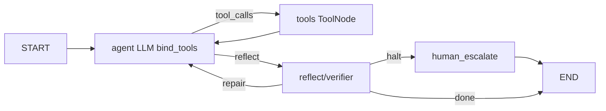

# NLP Assignment #5 — Agentic Systems (Track A only, Kaggle)

Цей репозиторій містить **один Kaggle-ноутбук** для Track A і допоміжні файли. Усі запуски, артефакти та метрики зберігаються в **`/kaggle/working/`** (Kaggle Output).

## Agent specification

- **Роль**: assistant для наукової літератури (arXiv / Semantic Scholar / OpenAlex) з MCP-grounding.
- **Вхід**: промпт задачі (одна з `TASKS`).
- **Вихід**: коротка відповідь, де ідентифікатори (arXiv id) мають бути підтверджені інструментами (ToolMessage).
- **Інструменти (MCP)**:
  - custom `literature_*` (arXiv search, S2 graph, OpenAlex lookup, bookkeeping)
  - third-party `fetch_*` (опційно) для HTTP fetch.
- **Контроль потоку**: LangGraph (agent → tools → agent → reflect/verifier → end).
- **Обмеження**: не вигадувати DOI/arXiv id; повага до rate limits; не писати секрети в логи.

### Mermaid diagram (control-flow)

## Durable state vs scratchpad (requirement)

`AgentState` розділено на:
- **messages**: transient діалог/ToolMessage (scratchpad)
- **plan**: короткий план кроків (durable)
- **facts**: витягнуті grounded факти/ідентифікатори (durable)
- **artifacts**: шляхи/артефакти (jsonl траєкторій, summary json) (durable)

## Tool contracts

| Tool | Args | Returns | Notes |
|---|---|---|---|
| `literature_arxiv_search` | `query`, `max_results` | hits з `arxiv_id`, `title`, `abstract`, `arxiv_abs_url` | кеш на диск, polite sleep |
| `literature_semanticscholar_graph` | `paper_identifier`, flags/limits | paper + citations/references | S2 graph API; ids grounded |
| `literature_openalex_work_lookup` | `query`, `per_page` | hits з `openalex_id`, `doi`, `year` | для бібліографії |
| `literature_research_bookkeeping` | `action`, payload | ok/stats/dedupe | локальні записи, без секретів |
| `fetch_*` (опц.) | URL / method | fetched text/json | third-party MCP |

## Eval rubric (Track A)

Кожна задача в `TASKS` має `rubric.must_use_tool_classes` та обмеження. Основні автоматизовані перевірки:
- **Ungrounded / hallucinated IDs**: arXiv id згадані в останньому AI-повідомленні, але відсутні в ToolMessage blob.
- **Tool-selection accuracy**: чи виконано вимогу `must_use_tool_classes` (за логом `tool_calls` у траєкторії).

## Outputs (Kaggle `/kaggle/working/`)

- `mini_eval_track_A_summary.json`: підсумки по задачах
- `nlp_assignment5_trajectories/*.jsonl`: траєкторії (state/tool_calls/usage/finish)

## Aggregate metrics (how to produce)

У ноутбуці є комірка **“Аналіз траєкторій (Track A)”**, яка друкує:
- tool-selection accuracy
- hallucinated/ungrounded IDs rate
- steps per task, wall_s per task
- token usage + cost (USD) якщо налаштовано цінники (див. env)

## Ablations

У ноутбуці є окремі комірки для трьох аблацій:
- **Model**: PRIMARY_MODEL vs SECONDARY_MODEL або Gemini модель через `NLP_A5_GEMINI_MODEL`
- **Prompt**: `NLP_ABL_PROMPT_VARIANT=B`
- **Graph**: `NLP_ABL_SIMPLE_GRAPH=1`

Кожна аблація пише `ablation_*.json` в `WORKDIR` і друкує порівняння.

## Failure traces (annotated)

Виберіть 3 файли з `nlp_assignment5_trajectories/*.jsonl` і додайте:
- короткий опис задачі
- де саме сталося: неправильний tool, ungrounded id, refusal, rate limit, тощо
- як виправляє verifier/repair loop

> Примітка: конкретні приклади залежать від запуску на Kaggle, тому вставляються після отримання траєкторій.

## Conclusions

Після запуску аблацій та аналізу:
- коротко підсумуйте trade-offs (якість vs кроки vs ціна)
- де агент найчастіше помиляється (tool selection, ungrounded ids, long tool loops)

